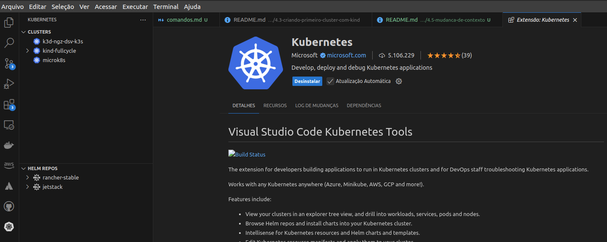

# Mudança de contexto e extensão VSCode.

- Exibir os cluster configurados na sua máquina.
```bash
kubectl config get-clusters
```

- Alterar para o cluster desejado:
```bash
kubectl config use-context kind-fullcycle
```

- Verificar a alteração, visualizando nodes do cluster:
```bash
kubectl get nodes
```

- Extensão para Kubernetes d Microsoft:

