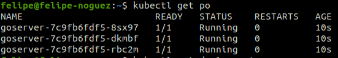
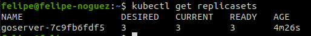

# Implementando Deployment.

- Nesta aula, foi copiado o "objeto' replicaset e alterado o nome para deployment, também foi modificado o "kind" de replicaset para deployment. Somente com esta alteração, agora, cada vez que aplicar o deployment, será recriado os pods. Após estas estapas, foi removido o repĺicaset, alterado a tag no deployment para latest e aplicado agora, o deployment.

- Comandos usados em aula:

- Listar os replicasets:
```bash
kubectl get replicasets
```

- Apagando replicaset:
```bash
kubectl delete replicaset goserver
```

- Movendo para a pasta da aula e executando o yaml:
```bash
kubectl apply -f deployment.yaml
```

```bash
kubectl get deployments
```

- Listar os pods:
```bash
kubectl get po
```

- Descrição do pod, para verificar que agora a imagem foi atualizada para "nova versão':
```bash
kubectl describe pod goserver-5b8fb5498-2pr64
```

- Agora, podemos ver que o nome é formado, com o nome do deploymet + nome aleatório de replicaset + nome aleatório para o pod na imagem abaixo aqui:


- e aqui:
