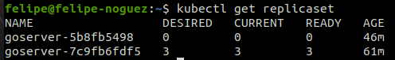

# Rollout e revisões.

- Comandos utilizados nesta aula.


- Exibe o histórico de revisões de uma implantação Kubernetes.
```bash
kubectl rollout history deployment goserver
```

- Reverte uma implantação do Kubernetes para uma revisão anterior, desfazendo as alterações feitas na implantação
```bash
kubectl rollout undo deployment goserver
```

- Exibe informações detalhadas do POD:
```bash
kubectl describe pod goserver-7c9fb6fdf5-hn84w
```

- Exibe uma lista de todos os ReplicaSets ativos em seu cluster Kubernetes:
```bash
kubectl get replicaset
```

- Reverte a implantação chamada "goserver" para a revisão de número 2:
```bash
kubectl rollout undo deployment goserver --to-revision=2
```

- Exibe informações detalhadas do deployment:
```bash
kubectl describe deployment goserver
```

- Como já haviamos visualizado na aula anteior, ao alterar a imagem aplicando o deployment, ao verificar o replicaset, vimos que foi criado um novo e mantido o replicaset anterior. Aogra ao realizarmos o rollout, podemos ver que retornou para o replicaset anterior e também mantem o replicaset mais recente.
