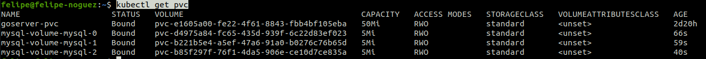

# Criando volumes dinamicamente com statefulset.


- Comandos udados em aula:

- Apagando statefulset para recriar com as novas congifs de Volumes:
```bash
kubectl delete statefulset mysql
```

- Aplicando yaml com novas configs de volumes dinamico no statefulset:
```bash
kubectl apply -f statefulset.yaml
```

- Listando pods
```bash
kubectl get po
```

- Listando os PVCs, é poseível ver que os volumes foram criados e "atachados":
```bash
kubectl get pvc
```


