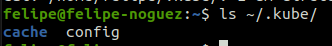

# Comandos utilizados em aula.

### Kubernetes:

- Pasta onde se encontra o configs dos Clusters já configurados
```bash
ls ~/.kube/
```


```bash
kubectl cluster-info
```

```bash
kubectl version --client
```

- Acessar o cluster no `context` `kind` com nome do cluster `kind`:
```bash
kubectl cluster-info --context kind-kind
```

- Visualizando nodes do cluster:
```bash
kubectl get nodes
```

- Alterar para o cluster desejado:
```bash
kubectl config use-context <nome-do-cluster>
```

- Exibir os cluster configurados na sua máquina.
```bash
kubectl config get-clusters
```

```bash

```

```bash

```

```bash

```

### Kind:

- Verificar versão do Kind:
```bash
kind version
```

- Criar um cluster:
```bash
kind create cluster
```

-
```bash

```

```bash

```