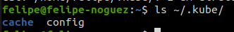

# Comandos utilizados em aula.

### Kubernetes:

- Pasta onde se encontra o configs dos Clusters já configurados
```bash
ls ~/.kube/
```


```bash
kubectl cluster-info
```

```bash
kubectl version --client
```

- Acessar o cluster no `context` `kind` com nome do cluster `kind`:
```bash
kubectl cluster-info --context kind-kind
```

- Visualizando nodes do cluster:
```bash
kubectl get nodes
```

- Alterar para o cluster desejado:
```bash
kubectl config use-context <nome-do-cluster>
```

- Exibir os cluster configurados na sua máquina.
```bash
kubectl config get-clusters
```

- Aplicando/executando yaml:
```bash
kubectl apply -f 4.2-primeiros-passos-na-pratica/4.2.2-trabalhando-com-pods/pod.yaml

kubectl apply -f 4.2-primeiros-passos-na-pratica/4.2.3-criando-primeira-replicaset/replicaset.yaml
```

- Comandos para vizualizar pods do cluster (qualquer um do comando à seguir):
```bash
kubectl get pods
kubectl get pod
kubectl get po
```

- Comandos para vizualizar todos os pods do cluster
```bash
kubectl get pod -A
```

- Workaround para acessar um pod sem ter configurado nenhum tipo de acesso.
```bash
kubectl port-forward pod/goserver 8001:80
```

- Removendo POD:
```bash
kubectl delete pod goserver
kubectl delete pod goserver-2n5d2
```

- Listar replicaset
```bash
kubectl get replicaset
kubectl get replicasets
```

- VExibe informações detalhadas do POD:
```bash
kubectl describe pod goserver-8p7vv
```

- Listar deployments
```bash
kubectl get deployments
```

- Exibe o histórico de revisões de uma implantação Kubernetes.
```bash
kubectl rollout history deployment goserver
```

- Reverte uma implantação do Kubernetes para uma revisão anterior, desfazendo as alterações feitas na implantação
```bash
kubectl rollout undo deployment goserver
```

- Reverte a implantação chamada "goserver" para a revisão de número 2:
```bash
kubectl rollout undo deployment goserver --to-revision=2
```

- Exibe informações detalhadas do deployment:
```bash
kubectl describe deployment goserver
```

### Kind:

- Verificar versão do Kind:
```bash
kind version
```

- Criar um cluster:
```bash
kind create cluster
```

-
```bash

```

```bash

```