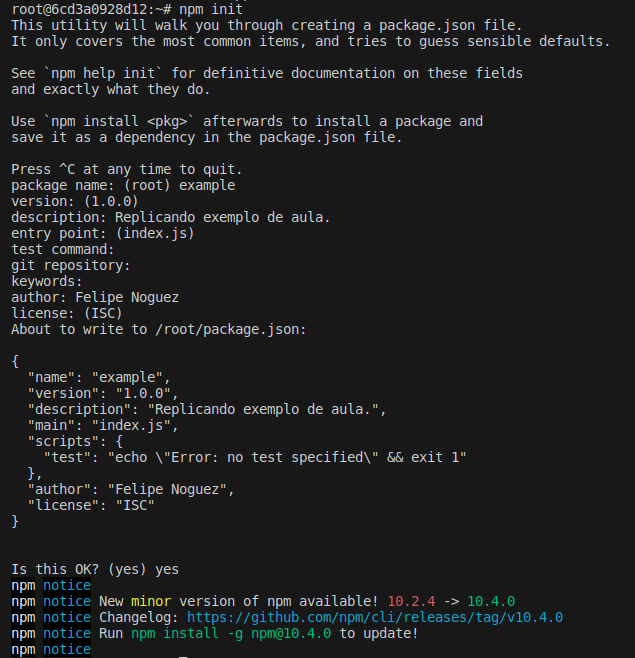

# Aula - Criando aplicação Node.js sem o Node.

- Executando imagem latest do Node, removendo container ao sair e publicando a porta 3000
`docker run --rm -it -v $(pwd)/:/usr/src/app -p 3000:3000 node:latest bash`

- Após rodar o container e já cair dentro do container, vamos mover para a pasta dentro do container:
`cd usr/src/app/`

- Com isto, se criarmos um arquivo com o comando `touch teste` no path /usr/src/app/, por exemplo, será criado o arquivo localmente também, conforme foi mapeado o volume -v $(pwd)/:/usr/src/app. Após realizado o teste criando o arquivo com o touch, vamos remover o arquivo:
`rm -f teste`

- Agora vamos criar um projeto Node com o comando:
`npm init`

- Abaixo print da configuração utilizada:

- Agora vamos instalar o express no mesmo path dentro do container (/usr/src/app):
`npm install express --save`

- Neste ponto, criamos o arquivo index.js, agora, vamos executar o comando para rodar a aplicação:
`node index.js'

## Continuação da aula

# Gerando imagem da aplicação Node.js.

- Agora vamos criar o Dockerfile, adicionar as configurações básicas e construir a imagem com o comando abaixo:
`docker build -t felipenoguez/hello-express .`

- Em seguida vamos executar a imagem publicando a porta:
`docker run -p 3000:3000 felipenoguez/hello-express`

Obs.: Podemos utilizar vários Dockerfiles (dev, prod, etc), abaixo segue o comando para executar nosso Dockerfile.prod:
`docker build -t felipenoguez/hello-express . -f Dockerfile.prod`