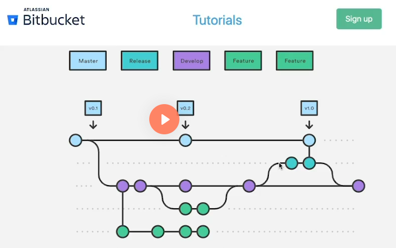
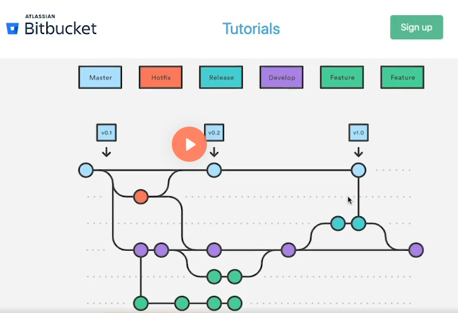

# Padrões e técnicas avançadas com Git e Github

## Instalação do Gitflow:

Links de referência:
https://www.atlassian.com/br/git/tutorials/comparing-workflows/gitflow-workflow

Link com o plugin:
https://github.com/nvie/gitflow/wiki/Manual-installation