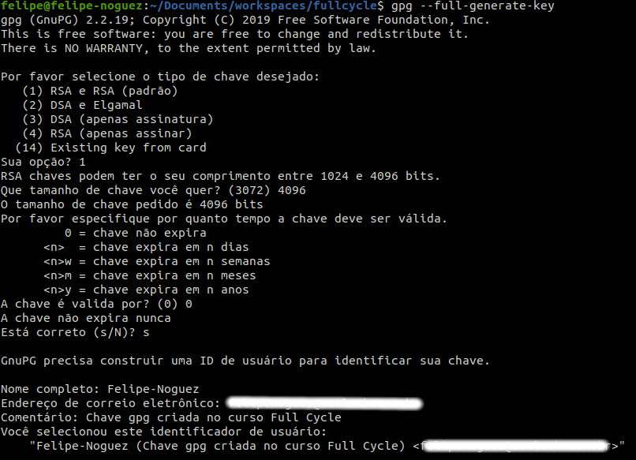

# Gerando chave gpg e assiando commits

- Listar
```bash
gpg --list-secret-keys --keyid-form LONG
```

- Criar
```bash
gpg --full-generate-key
```
- Opção de chave = "(1) RSA e RSA (padrão)"
- Tamanho da chave = 4096
- Chave valida por? 0 = não expira
- Nome completo: Felipe-Noguez


```bash
```

Novamente foi utilizado para verificar os dados da chave gerada:
```bash
gpg --list-secret-keys --keyid-form LONG
```

- sec   rsa4096/############### 2024-05-01 [SC]
-    tipo-chave-4096bits/id-da-chave | data da criação da chave


- Visualizando a chave no terminal para adicionar no Github em "Settings -> SSH and GPG keys"
```bash
gpg --armor --export
```


```bash
git config --global user.signingKey id-da-chave-gpg
```


- Feito estes passos, vamos adicionar ao 'bashrc' a variável de ambiente:
```bash
sudo vi ~/.bashrc
```

```bash
export GPG_TTY=$(tty)
```

- Comando para definir o padrão para assinar no repositório atual (path do terminal)
```bash
git config commit.gpgSign true
```
- Comando para definir o padrão para assinar todos os commits, independente de repositório.
```bash
git config --global commit.gpgSign true
```

- Comando para definir o padrão para assinar todas as tags, independente de repositório.
```bash
git config --global tag.gpgSign true
```

- Com -S para assinar o commit desejado, para o caso de que não tenha sido definido o padrão (--global) para assinatura do commit no comando ```git config --global commit.gpgSign true``` 
```bash
git commit -S -m "mensagem"
```

- Verificando a assinatura do commit
```bash
git log --show-signature -1
```

- Para o caso de o "agent" do gnuog não estiver rodando por padrão e seguir solicitando senha do gpg key, é necessário abrir o arquivo de configuração do gpg e adicionar a linha, conforme abaixo: (pesquisar, pois aparentemente, não tenho este arquivo no diretório exibido em aula e em busca de listar as confs, aparentemente não exixte este diretório)


- adicionar no arquivo de conf
```bash
use-agent
```

```bash
gpgconf --launch gpg-agent
```

- Chave salva:


#### Adicionando outro e-mail na chave gpg

```bash
gpg --list-secret-keys --keyid-form LONG
```

- Comando para editar a gpg key:
```bash
gpg --edit-key 876E472612292E0E
```

- Após utilizar o comando acima, será aberto o terminal 'gpg' para adicionar outro usuário, onde será usado o comando abaixo (conforme imagens abaixo):
```bash
adduid
```


- Agora vamos selecionar o segundo usuário, utiliznado:
```bash
uid 2
```


- Logo em seguida, é solicitado o nível de confiança, onde foi escolhido 'ultimate':
```bash
trust
```


- Após a edição com os passos, vamos salvar:

```bash
save
```

