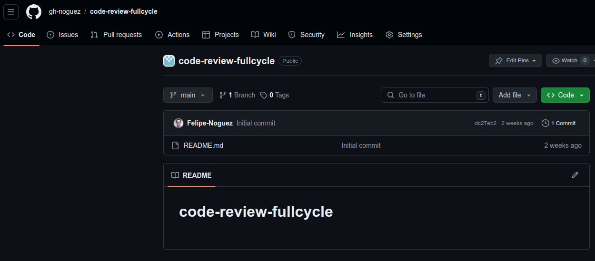
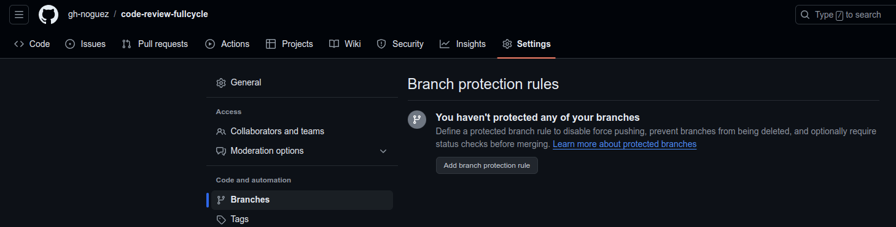
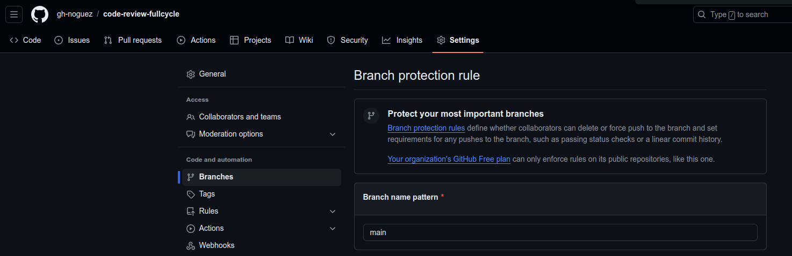
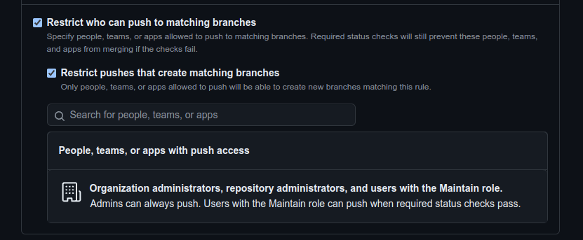
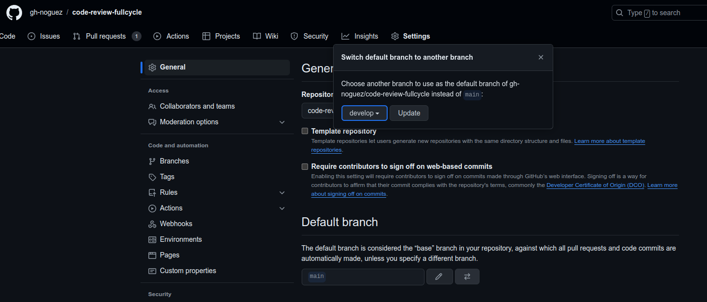

# Protegendo branches e code review.

- Pré requisitos:
    - Para realizar as configurações de aula, é necessário criar ou ter uma organização no Github.
    - Ter um repositório nesta organização.
    - Ter branch develop.

- Agora será configurado o "branch default" para receber os commits de desenvolvimento e o branch main será o "default" para o que está em produção.

- Para isto, vamos para o repositório na organização, clicar em settings, depois em "Branches" e então, clicar em "Add branch protection rule":

 
 

- Agora, aqui devemos selecionar "Branch name pattern", que neste primeiro caso será "main" e marcar "Restrict who can push to matching branches", em seguida realizar o mesmo processo para a branch "develop"

 
 

Definindo branch default
 