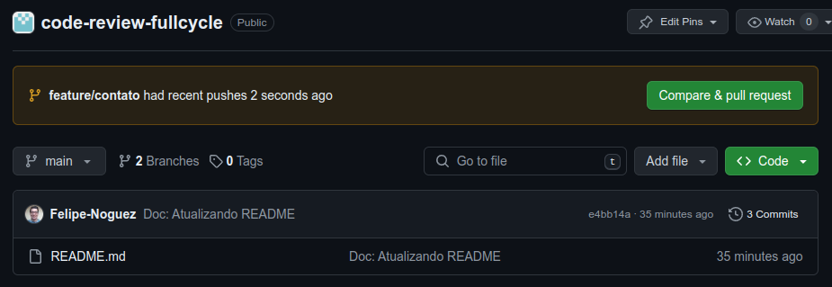
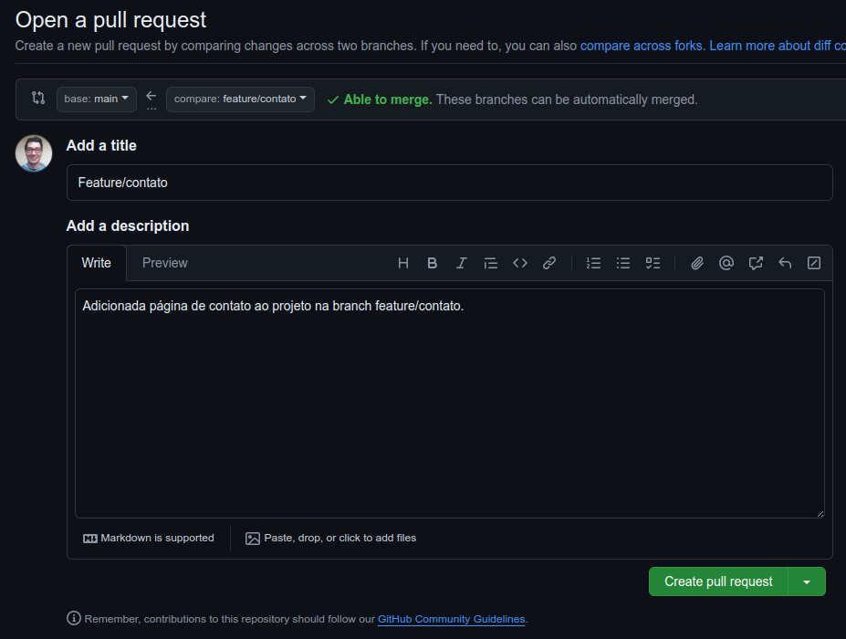
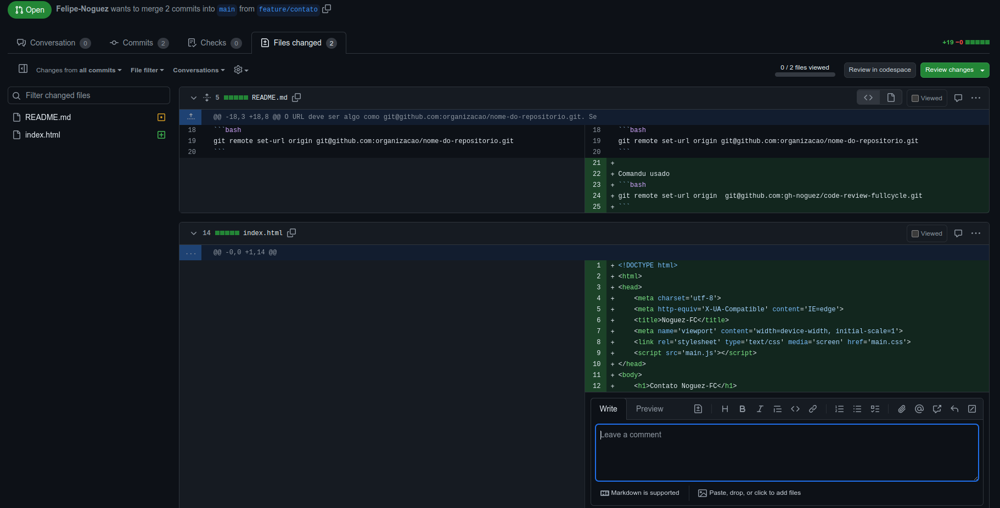
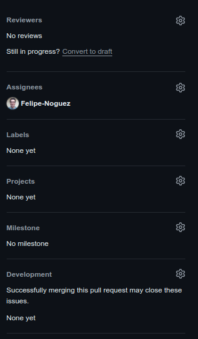
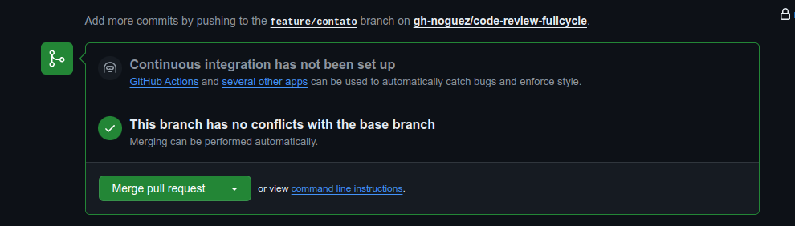
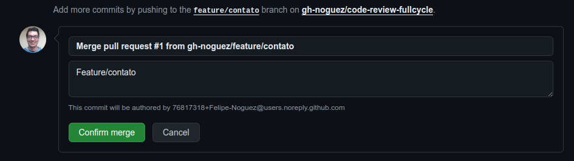
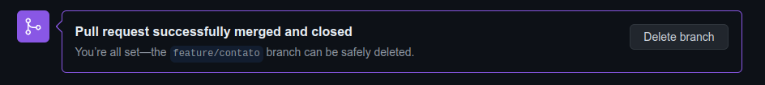

# Criando Pull Request (PR)

    - Criar uma branch

```bash
git checkout -b feature/contato
```

- Adicionar o index.html.

- Realizar o push

```bash
git push origin feature/contato
```

Após realizado os passos acima e o repositório configurado corretamente na organização ([aqui](https://github.com/gh-noguez/code-review-fullcycle) está a aula de configuração do repositório na organização), no Github apresentará a seguinte mensagem:



- Agora vamos clicar em "Compare & pull request" e em seguida, adicionar uma descrição para o PR e clicar em "Create pull request".



- Nesta tela, pode ver os commits, as mudanças nos arquivos, adicionar comentário em uma linha específica do código e iniciar uma revisão do código:




- Na aba "Conversation", na lateral direita, é exibido os "Reviews", é possível atribuir a PR para uma pessoa da organização, adicionar labes entre outras funções.



- Ainda na aba "Conversation", vamos rolar até o final, clicar em "Merge pull request", "Confirm merge" e "Delete branch":





- Após estes procedimentos, vamos também remover a branch local, utilizando o comando:

```bash
git branch -d nome-da-branch
```