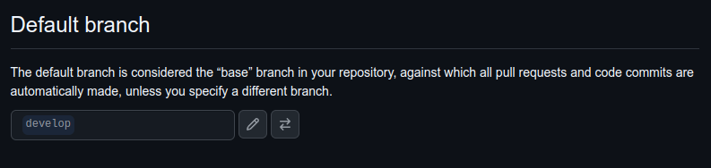
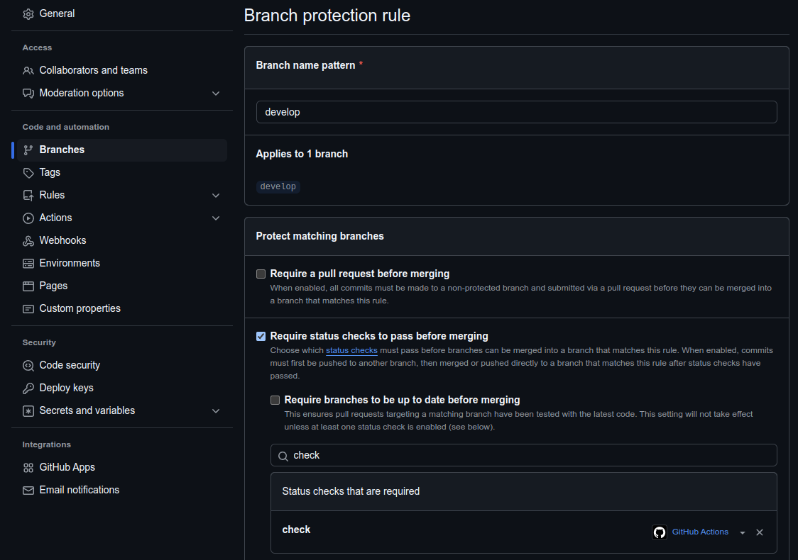
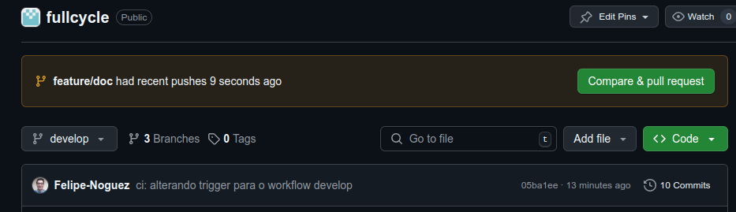
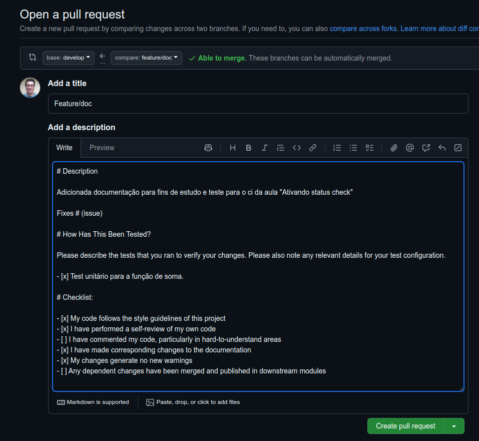
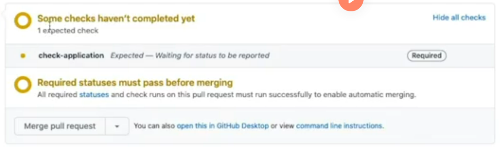
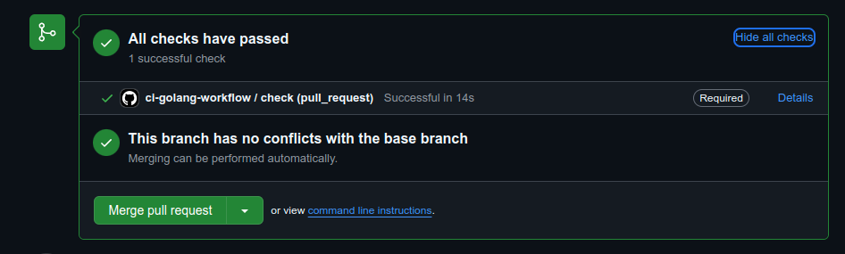
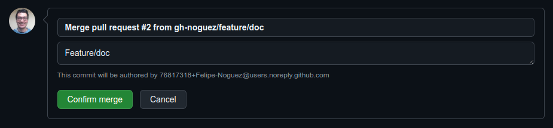
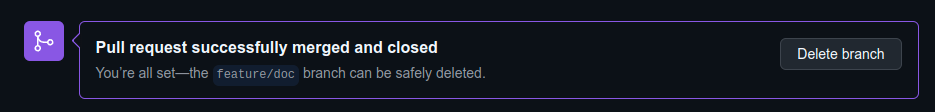

# Ativando status check

- Em settings selecionar a branch default como `develop`.



- Utilizando a organizçõ criada em aulas anteriores, onde já há as configurações necessárias para seguir com a aula. Configurações das branchs como, `develop`como branch default e `Restrict who can push to matching branches`.
- Em `Branches`, marcar `Require status checks to pass before merging`, marcar `Require branches to be up to date before merging`, buscar pelo nome dado ao jobs no workflow, neste caso, `check`, marcar `Restrict who can push to matching branches`, marcar `Restrict pushes that create matching branches` e replicar para a branch main .



- Com estas alterações no repositório, agora vamos realizar a alteração no [yaml](../../.github/workflows/ci.yaml) de configuração.
- Comandos e próximos passos:

- - Criando branch para a doc (pois para enviar a alteração do ci passo por ainda não estar ativada a opção `Do not allow bypassing the above settings`).
```bash
git checkout -b feature/doc
```

- - git add e git commit:

```bash
git add .github/workflows/ci.yaml
```

```bash
git commit -m "ci: alterando trigger para o workflow develop" 
```

```bash
git push origin develop 
```

- Agora, vamos para o Github para criar o pull request:


- Adionada a descrição com o template configurado para o pull request.



- Então será realizado o check antes de permitir o merge pull request:


- Agora que foi realizado o check e foi validado, podemos criar o merge pull request:






- Comandos e próximos passos:

```bash
git checkout develop
```
```bash
git pull origin develop
```
```bash
git branch -d feature/ci
```

Ps.: Para ocorrer a rejeição do push, alterei a configuração do repositório develop ativando `Do not allow bypassing the above settings`:


Documentação Github Action:
https://docs.github.com/pt/actions
