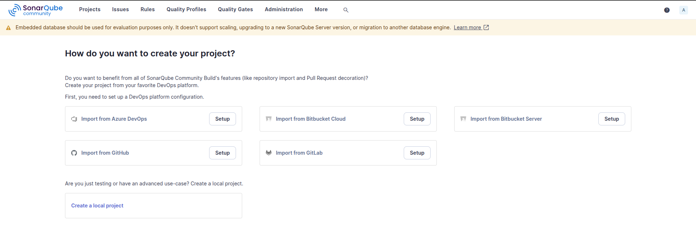
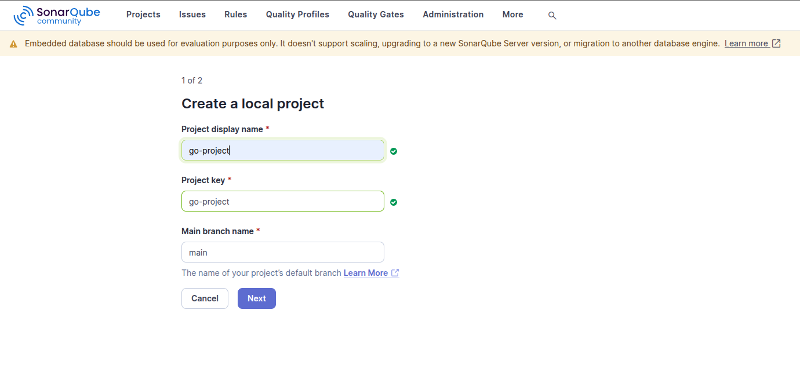
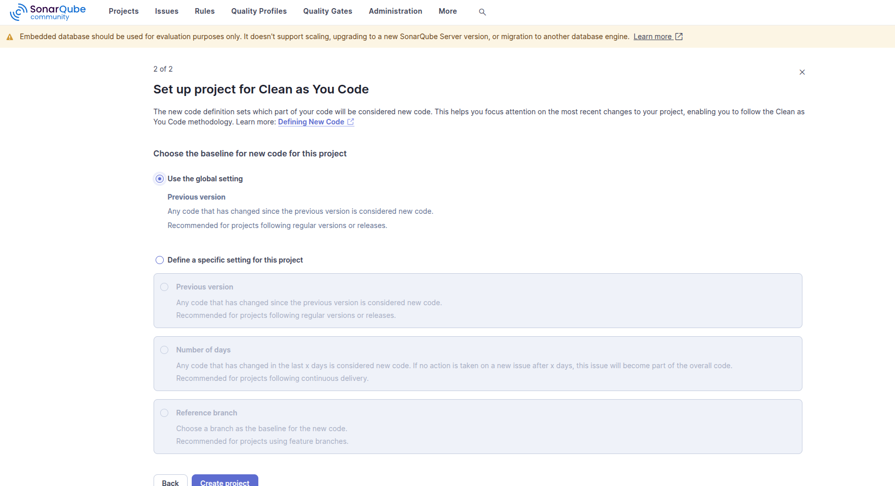
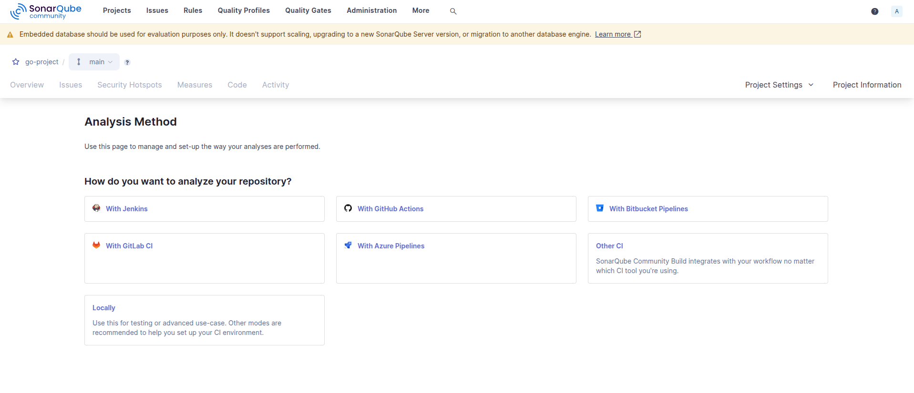
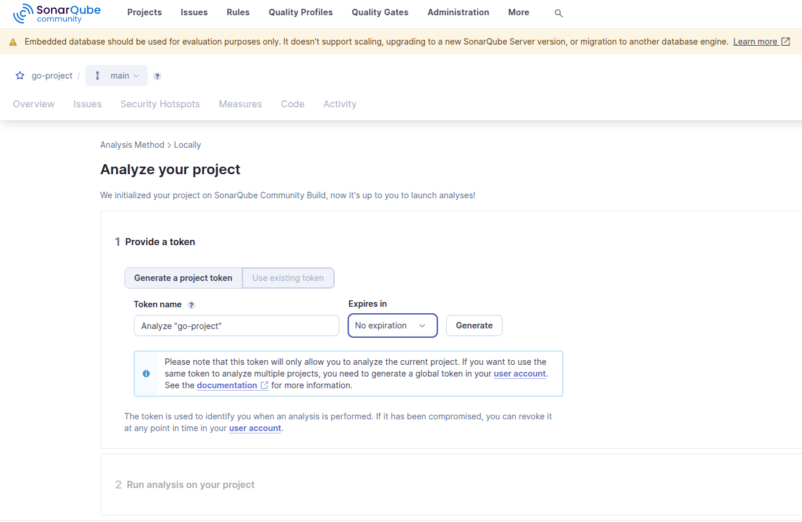
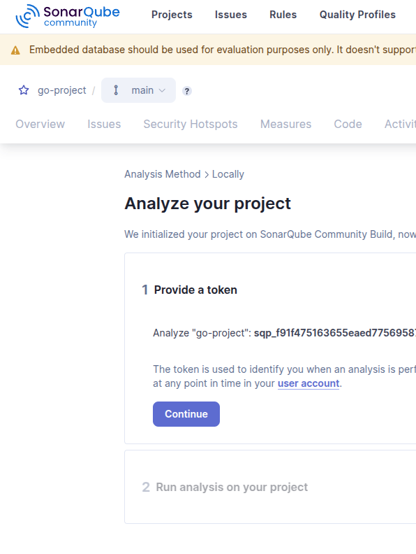
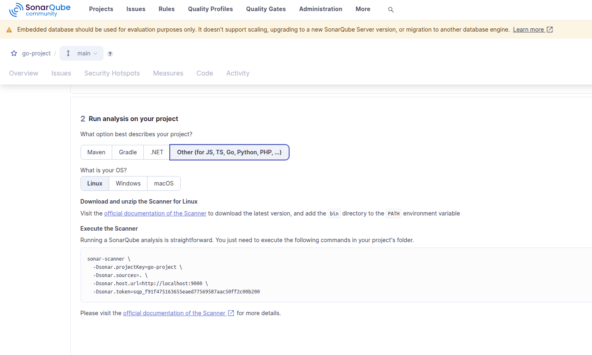
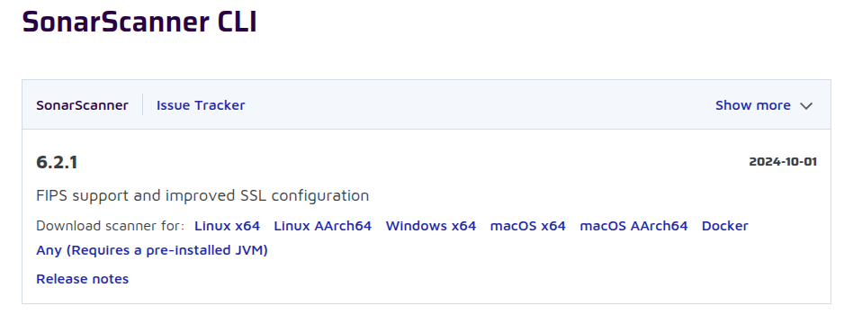

# Instalando primeiro projeto.

- Acessando localhost:9000, vamos até `Projects` e depois `Create a local project`:


- Agora, vamos dar um nome para o project:



- Aqui deixei como `Use global setting`:



- Aqui vamos selecionar `Localy`:



- Aqui deixei o nome que já veio na sugestão e cliquei em `Generate`, para gerar o Token:



- Em seguida cliquei em `Continue`:



- Nesta etapa, foi selecionado `Other` e `Linux`



- Obs.: Pré requisito para esta funcionalidade, é ter instalado o `Scanner`, link para download e instalação de acordo com sistema operacional [text](https://docs.sonarsource.com/sonarqube-community-build/analyzing-source-code/scanners/sonarscanner/)

- Instalação do `Scanner`: 

- - Download e decompactar no local desejado:


- - Adicionar ao PATH do bashrc:

```bash
sudo nano ~/.bashrc
```

```bash
export PATH=$PATH:/usr/local/sonar-scanner-6.2.1.4610-linux-x64/bin
```

- - Reiniciar:
```bash
source ~/.bashrc
```

- Após a instalação e feita a configuração de projeto local, vamos acessar o local da aplicação que desejamos adicionarao Sonarqube:

```bash
cd 7.3-instalando-primeiro-projeto/goapp
```

- E por fim, executar o comando gerado pelo Sonarqube:

```bash
sonar-scanner \
  -Dsonar.projectKey=go-project \
  -Dsonar.sources=. \
  -Dsonar.host.url=http://localhost:9000 \
  -Dsonar.token=sqp_60ce853be78cce27e550a4d02788c8df086423dc
```